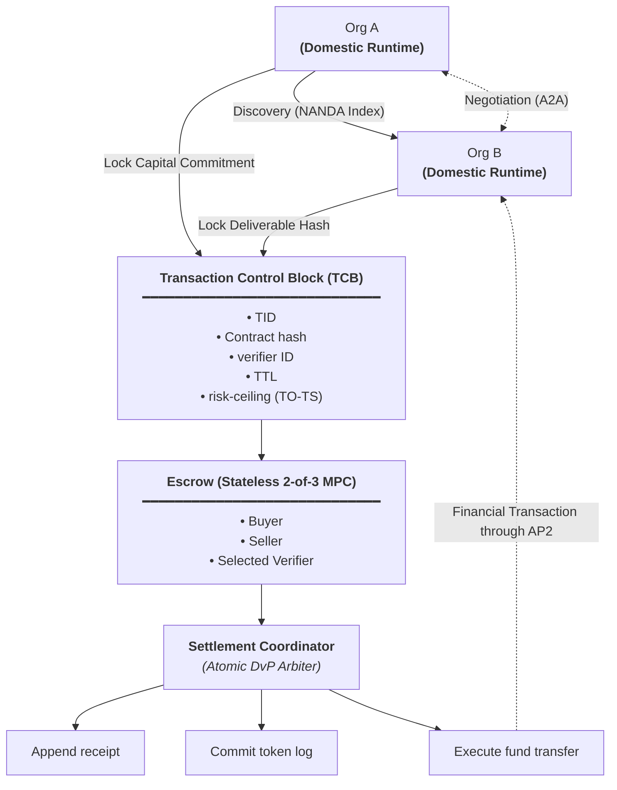

# FEIN: Financial Enterprise Intelligence Network

> **Initial Architectural Specification (Simulated Environment)**  
> *A coordination mechanism for bilateral commitment, verification, and conditional settlement between sovereign enterprise AI agents.*

---

## What FEIN Is

FEIN is a protocol mechanism that enables autonomous AI agents belonging to independent, sovereign organizations to:

1. **Lock bilateral commitments** before task execution (capital commitment from the buyer; deliverable hash from the seller).
2. **Verify delivered work** against agreed contractual criteria using an independent verifier.
3. **Conditionally allow settlement** through a decentralized, threshold-governed process.

The current focus is strictly the **binding + verification + conditional-release** path.

---

## What FEIN Is Not

To maintain precise architectural scope, FEIN explicitly excludes:
* **Discovery**: Locating counterparty agents is handled upstream (e.g., via the NANDA Index).
* **Communication & Negotiation**: Bilateral dialogue and contract negotiation are handled upstream (e.g., via Agent-to-Agent protocols like A2A).
* **Payment Rails**: Direct financial movement is delegated to existing payment systems (e.g., AP2 or banking rails).

For detailed boundaries, see [docs/03-non-goals.md](docs/03-non-goals.md).

---

## Architecture Overview

FEIN coordinates interactions between independent organizations operating private domestic runtimes.



### Key Components

* **Sovereign Organizations (Org A & Org B)**: Each organization operates its own domestic runtime, retaining full autonomy over internal models, data, and keys.
* **Transaction Control Block (TCB)**: The shared coordinator descriptor where both parties lock their commitments. Holds:
  * `TID`: Transaction Identifier
  * `Contract hash`: Digest of the negotiated contract
  * `verifier ID`: Designated independent verifier
  * `TTL`: Time-to-Live / expiration deadline
  * `risk-ceiling (TO-TS)`: Financial and operational tolerance limits
* **Escrow (Stateless 2-of-3 MPC)**: A decentralized custody and authorization mechanism across the Buyer, Seller, and Selected Verifier. Funds cannot be unilaterally moved; release requires 2-of-3 threshold authorization conditioned on verification.
* **Settlement Coordinator (Atomic DvP Arbiter)**: Acts as a Delivery versus Payment (DvP) arbiter, analogous to the commit coordinator in a distributed Two-Phase Commit (2PC). Upon valid threshold verification, it atomically produces three outputs:
  1. *Append receipt*: Audit trail record of completed delivery.
  2. *Commit token log*: State transition commitment.
  3. *Execute fund transfer*: Execution instruction to external payment rails (e.g., AP2) delivering funds to Org B.

---

## Repository Structure

```text
fein/
├── README.md                       # Project overview and architecture summary
├── LICENSE                         # MIT License
├── docs/
│   ├── 00-vision.md                # Motivation, sovereignty, and project scope
│   ├── 01-problem.md               # Asymmetric execution risk, verification gap, and 2PC analogy
│   ├── 02-architecture.md          # Architectural walkthrough (TCB, Escrow, DvP Arbiter)
│   └── 03-non-goals.md             # Boundaries and explicit exclusions
├── specs/
│   └── tcb-fields.md               # Conceptual field description for the Transaction Control Block
└── artifacts/
    └── architecture-diagram.mmd    # Conceptual architecture diagram (Mermaid source)
```

---

## Status and Scope Note

This repository contains the **initial design documentation** for FEIN within a simulated research environment. It establishes the conceptual foundation, problem framing, and component boundaries decided at this stage of the project. It does not contain production simulation code or represent a live payment infrastructure.
