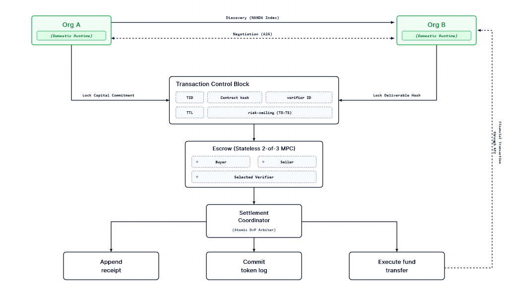

# Architecture Specification

## Overview

The FEIN architecture provides a structured, verifiable bridge between two sovereign enterprise runtimes. It guarantees that commitments are bound, verified, and settled atomically without requiring either organization to yield control over its domestic environment.



---

## Architectural Components

The architecture consists of four primary conceptual layers:

```
+---------------------------------------------------------------------------------+
|                               Org A (Domestic Runtime)                          |
|                                       │                                         |
|  [External Inputs]                    │ Lock Capital Commitment                 |
|  * Discovery (NANDA Index)            ▼                                         |
|  * Negotiation (A2A)        ┌───────────────────────────────────┐               |
|                             │     Transaction Control Block     │               |
|                             │  (TID, Contract Hash, Verifier ID,│               |
|                             │   TTL, Risk-Ceiling (TO-TS))      │               |
|                             └───────────────────────────────────┘               |
|                                       ▲                                         |
|                                       │ Lock Deliverable Hash                   |
|                                       │                                         |
|                               Org B (Domestic Runtime)                          |
+---------------------------------------┼-----------------------------------------+
                                        │
                                        ▼
                   ┌─────────────────────────────────────────┐
                   │       Escrow (Stateless 2-of-3 MPC)     │
                   │  * Buyer (Org A)                        │
                   │  * Seller (Org B)                       │
                   │  * Selected Verifier                    │
                   └─────────────────────────────────────────┘
                                        │
                                        ▼
                   ┌─────────────────────────────────────────┐
                   │          Settlement Coordinator         │
                   │           (Atomic DvP Arbiter)          │
                   └────────────────────┬────────────────────┘
                                        │
             ┌──────────────────────────┼──────────────────────────┐
             ▼                          ▼                          ▼
    ┌─────────────────┐        ┌─────────────────┐        ┌─────────────────┐
    │  Append Receipt │        │ Commit Token    │        │  Execute Fund   │
    │                 │        │      Log        │        │    Transfer     │
    │                 │        │                 │        │   (e.g., AP2)   │
    └─────────────────┘        └─────────────────┘        └────────┬────────┘
                                                                   │
                                                                   ▼
                                                       (Settlement to Org B)
```

---

### 1. Sovereign Organizations & External Inputs

* **Org A and Org B (Domestic Runtimes)**: Sovereign organizations operating internal agent execution systems. Each maintains its own security boundary, policy engines, and credential stores.
* **Discovery (NANDA Index)**: An assumed upstream discovery service where organizations locate compatible counterparty agents. FEIN does not implement discovery; it assumes counterparties have already identified one another.
* **Negotiation (A2A)**: An assumed bilateral negotiation protocol through which Org A and Org B agree upon transaction scope, pricing, deliverable expectations, verification criteria, and timeout terms.

---

### 2. Transaction Control Block (TCB)

The **Transaction Control Block (TCB)** acts as the shared immutable coordinator state for the bilateral transaction—analogous to the prepare-phase descriptor in distributed transactions.

Before task computation proceeds, both organizations lock their commitments into the TCB:
* **Org A (Buyer)** locks its **Capital Commitment**, guaranteeing funds are reserved and authorized for this specific agreement.
* **Org B (Seller)** locks its **Deliverable Hash**, cryptographically committing to the target deliverable representation or schema before or upon completion.

The TCB records the following essential parameters:
* `TID`: Unique transaction session identifier.
* `Contract hash`: Cryptographic digest of the negotiated bilateral contract.
* `verifier ID`: Identity or cryptographic key of the mutually agreed verification party.
* `TTL`: Time-to-Live timestamp determining the transaction expiration boundary.
* `risk-ceiling (TO-TS)`: Specified risk ceiling and operational tolerance constraints for the bilateral exchange.

---

### 3. Escrow (Stateless 2-of-3 MPC)

Custody and release authority are governed by a **Stateless 2-of-3 Multi-Party Computation (MPC)** construct. 

* **Signatories**:
  1. Buyer (Org A)
  2. Seller (Org B)
  3. Selected Verifier

* **Decentralized Authorization**:
  No single entity—neither the buyer, the seller, nor the verifier—can unilaterally release or confiscate funds. Authorization requires a 2-of-3 threshold:
  * **Standard Success Path (Buyer + Verifier or Seller + Verifier)**: When the Selected Verifier confirms that Org B's deliverable matches the contract hash and acceptance criteria, threshold consensus is reached to authorize release to the seller.
  * **Cooperative Resolution (Buyer + Seller)**: If both organizations mutually agree to complete or cancel without verifier intervention.
  * **Dispute / Expiration Path (Buyer + Verifier upon failure / TTL expiry)**: If verification fails or the TTL lapses without valid deliverable verification, funds are authorized for refund to the buyer.

* **Stateless Property**:
  The escrow mechanism does not maintain a permanent monolithic state machine. It is initialized per-transaction using the parameters bound in the TCB and cleanly terminates upon settlement resolution.

---

### 4. Settlement Coordinator (Atomic DvP Arbiter)

The **Settlement Coordinator** is the arbiter of Delivery versus Payment (DvP). Once the 2-of-3 MPC conditions are verified, the coordinator executes an atomic state transition producing three synchronized outputs:

1. **Append Receipt**: Generates a verifiable, immutable receipt documenting delivery and execution.
2. **Commit Token Log**: Records the finalized transaction state in the token/accounting audit log.
3. **Execute Fund Transfer**: Dispatches the payment execution instruction across designated financial rails (such as AP2) to deliver funds directly into Org B's domestic account.

---

## Transaction Lifecycle Summary

1. **Upstream Alignment**: Org A and Org B discover each other (via NANDA Index) and negotiate terms (via A2A).
2. **Commitment Binding**:
   - The TCB is instantiated with transaction terms (`TID`, `Contract hash`, `verifier ID`, `TTL`, `risk-ceiling`).
   - Org A locks capital commitment; Org B locks deliverable hash.
3. **Execution & Delivery**: Org B computes the deliverable in its domestic runtime and presents the output against the committed hash.
4. **Independent Verification**: The Selected Verifier validates the deliverable against the contract criteria.
5. **Threshold Release**: Upon successful validation, the 2-of-3 MPC threshold is satisfied.
6. **Atomic Settlement**: The Settlement Coordinator appends the receipt, commits the token log, and executes fund transfer via external rails (AP2) to Org B.
